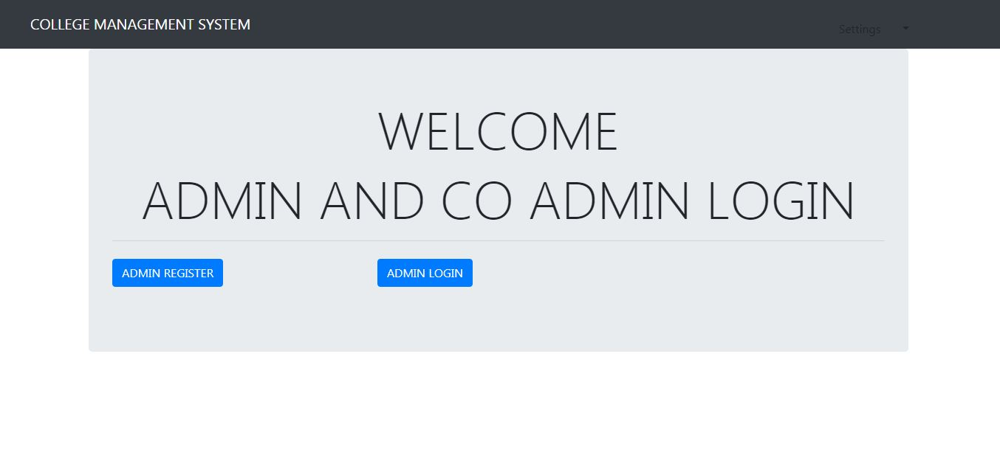
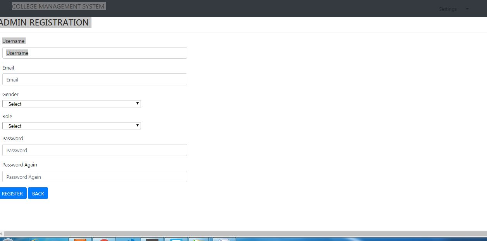
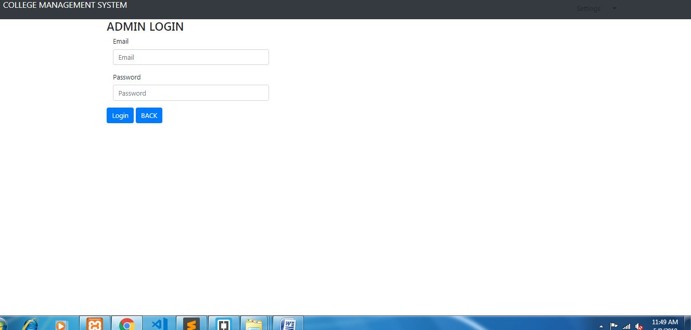
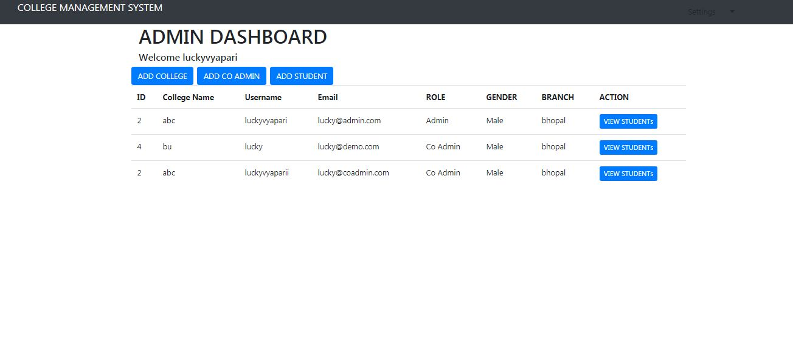
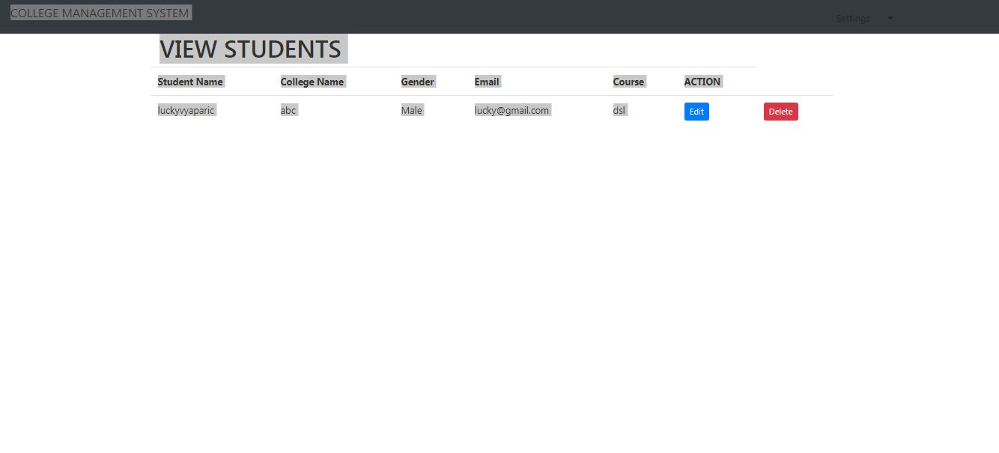
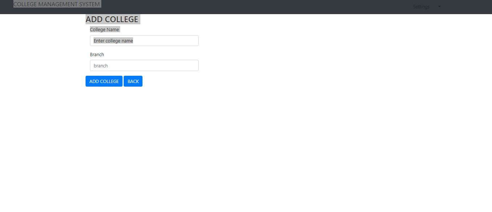
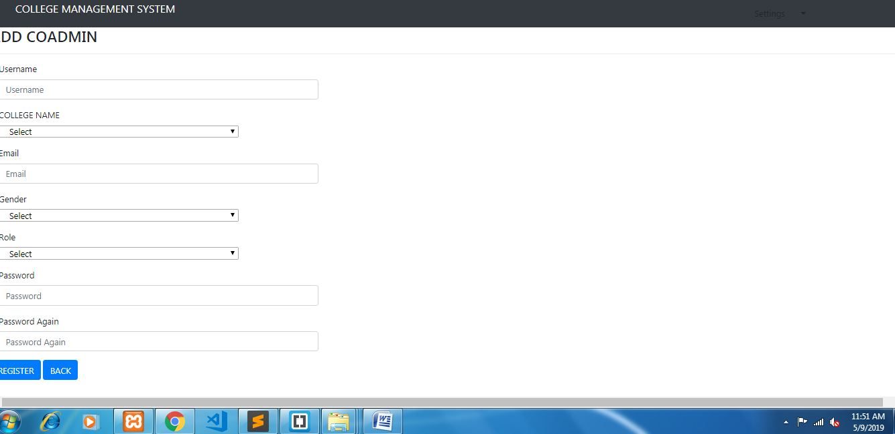
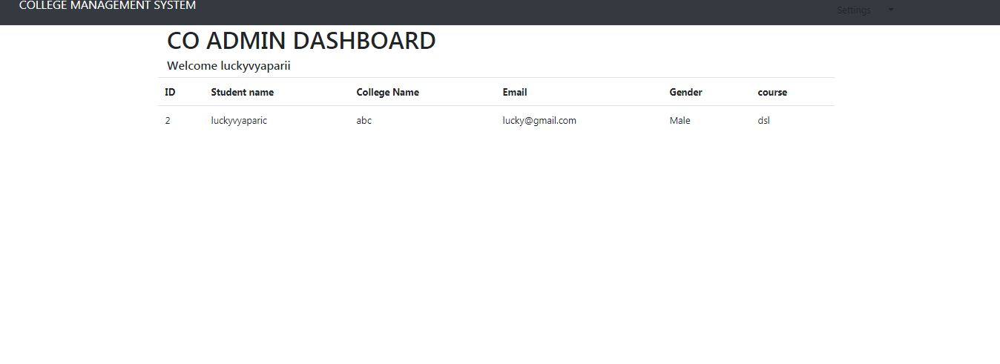

# Project Name
>College MANAGEMENT SYSYTEM

## Table of contents
* [General info](#general-info)
* [Screenshots](#screenshots)
* [Technologies](#technologies)
* [Setup](#setup)
* [Features](#features)
* [Status](#status)
* [Inspiration](#inspiration)
* [Contact](#contact)

## General info
This is a COllege MANAGEMENT SYSYTEM  function by PHP CodeIgniter framework.

## Screenshots

## Technologies
* Tech 1 - codeigniter
* Tech 2 - php
* Tech 3 - html
* Tech 1 - css
* Tech 2 - bootstrap

## Setup

You’ll need XAMP Server or WAMP Server. Put the file inside “c:/wamp/www/” or “c:/xampp/htdocs/”. Go To “localhost/phpmyadmin” in any browser and create Database named “collegems”.In That Database, Import collegems.sql and finally open go to URL: “http://localhost/file_name/phpfilename”
Don’t Forget To create a database and import sql file to run.

admin login-
email-lucky@admin.com
password-123

co-admin login-
email-lucky@admin.com
password-123

## Features
List of features ready and TODOs for future development
* REgistration page for admin of college.
* LOG IN page for admin and co-admin.
* Different dashboard for admin and co-admin.

*****ADMIN features****
* ADMIN can add college name and location.
* ADMIN can add co-admin.
* ADMIN can view all co-admins
* ADMIN can add students.
* ADMIN can add college name and location.
* ADMIN can see details of students.
* ADMIN can edit the details of students.
* ADMIN can delete the details of students.

* C0-ADMIN ADMIN can see all details of students.

To-do list:
* many things could be added in features

## Status
Project is:  _finished.

## Inspiration
Project inspired by udemy course, based on college management system

## Contact
Created by LUCKY VYAPARI - feel free to contact me!
***It is a zip folder, for see the source code you should download it.***

Thanks from ***LUCKY VYAPARI.***
